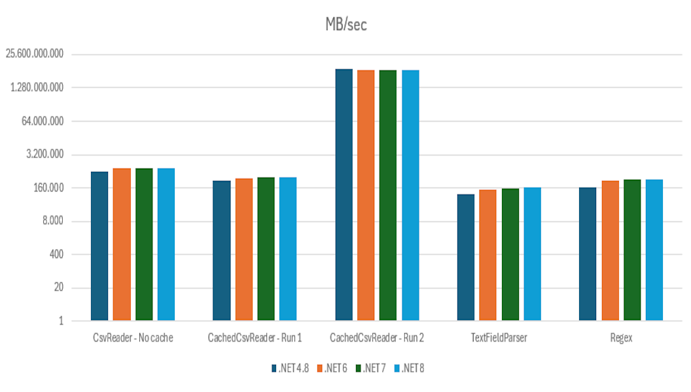

CSV Reader
==========

The [CsvReader](https://www.nuget.org/packages/LumenWorksCsvReader2/) library is an extended version of Sébastien Lorion's [fast CSV Reader](http://www.codeproject.com/Articles/9258/A-Fast-CSV-Reader) project 
and provides fast parsing and reading of CSV files

[](https://www.nuget.org/packages/LumenWorksCsvReader2/) [](https://ci.appveyor.com/project/drcolombo/csvreader/branch/master)

To this end it is a straight drop-in replacement for the existing NuGet package [LumenWork.Framework.IO](https://www.nuget.org/packages/LumenWorks.Framework.IO/) and [LumenWorksCsvReader](https://www.nuget.org/packages/LumenWorksCsvReader2/), but with additional
capabilities; the other rationale for the project is that the code is not available elsewhere in a public source repository, making it difficult to extend/contribute to.

Welcome to contributions from anyone.

You can see the version history [here](RELEASE_NOTES.md).

## Build the project
* Install [Fake](https://fake.build/fake-gettingstarted.html)
* In the command line run *dotnet fake build*

## Library License

The library is available under the [MIT License](http://en.wikipedia.org/wiki/MIT_License), for more information see the [License file][1] in the GitHub repository.

 [1]: https://github.com/phatcher/CsvReader/blob/master/License.md

## Getting Started
A good starting point is to look at Sébastien's [article](http://www.codeproject.com/Articles/9258/A-Fast-CSV-Reader) on Code Project.

A basic use of the reader something like this...
```csharp
    using System.IO;
    using LumenWorks.Framework.IO.Csv;

    void ReadCsv()
    {
        // open the file "data.csv" which is a CSV file with headers
        using (var csv = new CachedCsvReader(new StreamReader("data.csv"), true))
        {
            // Field headers will automatically be used as column names
            myDataGrid.DataSource = csv;
        }
    }
```
Having said that, there are some extensions built into this version of the library that it is worth mentioning.

## Additional Features

### Columns
One addition is the addition of a Column list which holds the names and types of the data in the CSV file. If there are no headers present, we default the column names to Column1, Column2 etc; this can be overridden by setting the DefaultColumnHeader property e.g.
```csharp
    using System.IO;
    using LumenWorks.Framework.IO.Csv;

    void ReadCsv()
    {
        // open the file "data.csv" which is a CSV file with headers
        using (var csv = new CachedCsvReader(new StreamReader("data.csv"), false))
        {
            csv.DefaultColumnHeader = "Fred"

            // Field headers will now be Fred1, Fred2, etc
            myDataGrid.DataSource = csv;
        }
    }
```

You can specify the columns yourself if there are none, and also specify the expected type; this is especially important when using against SqlBulkCopy which we will come back to later.
```csharp
    using System.IO;
    using LumenWorks.Framework.IO.Csv;

    void ReadCsv()
    {
        // open the file "data.csv" which is a CSV file with headers
        using (var csv = new CachedCsvReader(new StreamReader("data.csv"), false))
        {
            csv.Columns.Add(new Column { Name = "PriceDate", Type = typeof(DateTime) });
            csv.Columns.Add(new Column { Name = "OpenPrice", Type = typeof(decimal) });
            csv.Columns.Add(new Column { Name = "HighPrice", Type = typeof(decimal) });
            csv.Columns.Add(new Column { Name = "LowPrice", Type = typeof(decimal) });
            csv.Columns.Add(new Column { Name = "ClosePrice", Type = typeof(decimal) });
            csv.Columns.Add(new Column { Name = "Volume", Type = typeof(int) });

            // Field headers will now be picked from the Columns collection
            myDataGrid.DataSource = csv;
        }
    }
```

### SQL Bulk Copy
One use of CSV Reader is to have a nice .NET way of using SQL Bulk Copy (SBC) rather than bcp for bulk loading of data into SQL Server.

A couple of issues arise when using SBC
	1. SBC wants the data presented as the correct type rather than as string
	2. You need to map between the table destination columns and the CSV if the order does not match *exactly*
	
Below is a example using the Columns collection to set up the correct metadata for SBC
```csharp
	public void Import(string fileName, string connectionString)
	{
		using (var reader = new CsvReader(new StreamReader(fileName), false))
		{
			reader.Columns = new List<LumenWorks.Framework.IO.Csv.Column>
			{
				new LumenWorks.Framework.IO.Csv.Column { Name = "PriceDate", Type = typeof(DateTime) },
				new LumenWorks.Framework.IO.Csv.Column { Name = "OpenPrice", Type = typeof(decimal) },
				new LumenWorks.Framework.IO.Csv.Column { Name = "HighPrice", Type = typeof(decimal) },
				new LumenWorks.Framework.IO.Csv.Column { Name = "LowPrice", Type = typeof(decimal) },
				new LumenWorks.Framework.IO.Csv.Column { Name = "ClosePrice", Type = typeof(decimal) },
				new LumenWorks.Framework.IO.Csv.Column { Name = "Volume", Type = typeof(int) },
			};

			// Now use SQL Bulk Copy to move the data
			using (var sbc = new SqlBulkCopy(connectionString))
			{
				sbc.DestinationTableName = "dbo.DailyPrice";
				sbc.BatchSize = 1000;

				sbc.AddColumnMapping("PriceDate", "PriceDate");
				sbc.AddColumnMapping("OpenPrice", "OpenPrice");
				sbc.AddColumnMapping("HighPrice", "HighPrice");
				sbc.AddColumnMapping("LowPrice", "LowPrice");
				sbc.AddColumnMapping("ClosePrice", "ClosePrice");
				sbc.AddColumnMapping("Volume", "Volume");

				sbc.WriteToServer(reader);
			}
		}
	}
```
The method AddColumnMapping is an extension I wrote to simplify adding mappings to SBC
```csharp
    public static class SqlBulkCopyExtensions
    {
        public static SqlBulkCopyColumnMapping AddColumnMapping(this SqlBulkCopy sbc, int sourceColumnOrdinal, int targetColumnOrdinal)
        {
            var map = new SqlBulkCopyColumnMapping(sourceColumnOrdinal, targetColumnOrdinal);
            sbc.ColumnMappings.Add(map);

            return map;
        }

        public static SqlBulkCopyColumnMapping AddColumnMapping(this SqlBulkCopy sbc, string sourceColumn, string targetColumn)
        {
            var map = new SqlBulkCopyColumnMapping(sourceColumn, targetColumn);
            sbc.ColumnMappings.Add(map);

            return map;
        }
    }
```	
One other issue recently arose where we wanted to use SBC but some of the data was not in the file itself, but metadata that needed to be included on every row. The solution was to amend the CSV reader and Columns collection to allow default values to be provided that are not in the data.

The additional columns should be added at the end of the Columns collection to avoid interfering with the parsing, see the amended example below...
```csharp
	public void Import(string fileName, string connectionString)
	{
		using (var reader = new CsvReader(new StreamReader(fileName), false))
		{
			reader.Columns = new List<LumenWorks.Framework.IO.Csv.Column>
			{
			    ...
				new LumenWorks.Framework.IO.Csv.Column { Name = "Volume", Type = typeof(int) },
				// NB Fake column so bulk import works
                new LumenWorks.Framework.IO.Csv.Column { Name = "Ticker", Type = typeof(string) },
			};

			// Fix up the column defaults with the values we need
            reader.UseColumnDefaults = true;
			reader.Columns[reader.GetFieldIndex("Ticker")] = Path.GetFileNameWithoutExtension(fileName);

			// Now use SQL Bulk Copy to move the data
			using (var sbc = new SqlBulkCopy(connectionString))
			{
				...
				sbc.AddColumnMapping("Ticker", "Ticker");

				sbc.WriteToServer(reader);
			}
		}
	}
```

#### VirtualColumns
It may happen that your database table where you would like to import a CSV contains more or different columns than your CSV file.
As SqlBulkCopy requires to define all column mappings from the target table, you can use the VirtualColumns functionality:
```csharp
    csv.VirtualColumns.Add(new Column { Name = "SourceTypeId", Type = typeof(int), DefaultValue = "1", NumberStyles = NumberStyles.Integer });
    csv.VirtualColumns.Add(new Column { Name = "DataBatchId", Type = typeof(int), DefaultValue = dataBatchId.ToString(), NumberStyles = NumberStyles.Integer });
```
In this case you define 2 additional columns that do not exist in the source CSV file, but exist in the target table. Also you can set the DefaultValue that will be bulk-copied to the target table together with the CSV file content. Do not forget to include the defined virtual columns to the SqlBulkCopy column mapping!

#### ExcludeFilter
In case if your CSV file is big enough and you do not want to import a whole file but some set of data, you can set the ExcludeFilter action:
```csharp
csv.ExcludeFilter = () => ((csv["Fmly"] ?? "") + (csv["Group"] ?? "") + (csv["Type"] ?? "")).ToUpperInvariant() == "EQDEQUIT";
```
In this case all rows that fit the defined criteria will not be imported to the database.

## Performance
To give an idea of performance, this took a naive sample app using an ORM from 2m 27s to 1.37s using SBC and the full import took just over 11m to import 9.8m records.

One of the main reasons for using this library is its excellent performance on reading/parsing raw data, here's a recent run of the benchmark (which is in the source)

|Test|.NET 4.7.2|.NET 4.8|.NET Core 3.1|.NET 5|.NET 6|
|---|---|---|---|---|---|
Test pass #1 - All fields|
CsvReader - No cache   |18.029|17.4115|18.6588|20.9881|19.8229
CachedCsvReader - Run 1|15.8878|15.6856|16.4155|19.478|19.2338
CachedCsvReader - Run 2|103700.2121|100227.7904|119402.9851|102923.9766|119532.7357
TextFieldParser        |10.6325|10.7448|11.3845|13.3976|13.4799
Regex                  |11.0006|11.2566|11.603|16.8422|16.6653
|||||||
Test pass #1 - Field #72 (middle)|
CsvReader - No cache   |33.8842|34.4039|34.5182|48.3443|47.2414
CachedCsvReader - Run 1|20.0675|20.0483|21.5359|24.4861|24.2664
CachedCsvReader - Run 2|1647940.075|1325301.205|1050119.332|1148825.065|1170212.766
TextFieldParser        |10.5588|10.8054|11.5507|13.6496|13.9692
Regex                  |23.8385|24.2478|25.6357|40.7933|40.2386
|||||||
Test pass #2 - All fields|
CsvReader - No cache   |23.7762|24.7155|24.7757|29.4928|29.2318
CachedCsvReader - Run 1|15.4433|15.4299|16.2404|19.0609|18.7912
CachedCsvReader - Run 2|1325301.205|1506849.315|1100000|1242937.853|1428571.429
TextFieldParser        |9.4764|10.7936|11.583|13.7241|14.1607
Regex                  |9.8131|11.3284|11.8905|17.1912|17.816
|||||||
Test pass #2 - Field #72 (middle)|
CsvReader - No cache   |34.8114|34.8461|35.5218|49.8421|49.2037
CachedCsvReader - Run 1|20.719|20.7746|21.8001|25.8437|25.2911
CachedCsvReader - Run 2|1317365.27|1264367.816|1002277.904|1242937.853|1225626.741
TextFieldParser        |10.3391|10.5819|11.5539|13.5875|14.1446
Regex                  |23.8867|23.6028|25.0774|41.7542|40.7904
|||||||
Test pass #3 - All fields|
CsvReader - No cache   |24.5748|24.0699|24.4865|29.4968|29.041
CachedCsvReader - Run 1|14.6422|14.7653|16.7683|20.3806|18.0145
CachedCsvReader - Run 2|1379310.345|1383647.799|1006864.989|1173333.333|1157894.737
TextFieldParser        |10.7302|10.6394|11.5478|13.5921|14.2006
Regex                  |11.0881|11.0249|11.4958|17.9792|17.6474
|||||||
Test pass #3 - Field #72 (middle)|
CsvReader - No cache   |34.4315|35.0067|34.5559|50.7796|49.0471
CachedCsvReader - Run 1|17.3084|19.1313|17.2032|21.462|23.9831
CachedCsvReader - Run 2|1442622.951|1428571.429|1047619.048|1242937.853|1192411.924
TextFieldParser        |10.7142|10.5523|11.5291|13.7035|14.1779
Regex                  |23.3738|23.7406|25.1373|41.8325|41.2974


|Average of all test passes|.NET 4.7.2|.NET 4.8|.NET Core 3.1|.NET 5|.NET 6|
|---|---|---|---|---|---|
CsvReader - No cache   |28.2512|28.4089|28.7528|38.1573|37.2647
CachedCsvReader - Run 1|17.3447|17.6392|18.3272|21.7852|21.5967
CachedCsvReader - Run 2|1.202.706.6762|1.168.160.8923|887.714.0429|1.025.649.3224|1.049.041.7220
TextFieldParser        |10.4085|10.6862|11.5248|13.6091|14.0222
Regex                  |17.1668|17.5335|18.4733|29.3988|29.0759

As you can see, an average performance slightly increases from full .NET Framework 4.7.2 to .NET Core 6.

This was run on a Core i5-8400 (6 cores), 32Gb RAM and 2Tb SSD.
